<h1 align="center"> c# kargo Takıp otomasyon / Cargo Shipping management system</h1>

Bu kargo takip otomasyonu uygulaması benim üniversite projesidir,bu proje kargo takip etmek için tasarlanmıştır . Uygulama dıl:C# ve veritabana yapısı: MSSQL .

This Cargo management system is designed to manage and track cargo movements in a company. It includes features such as cargo registration and tracking build with:c# and database: MSSQL (the project in Turkish ).

- veritabana dosyada var / database included .

### Built With

- [C#]

## Contact

- GitHub [Hamza Tizra](https://github.com/Tizrex)
- 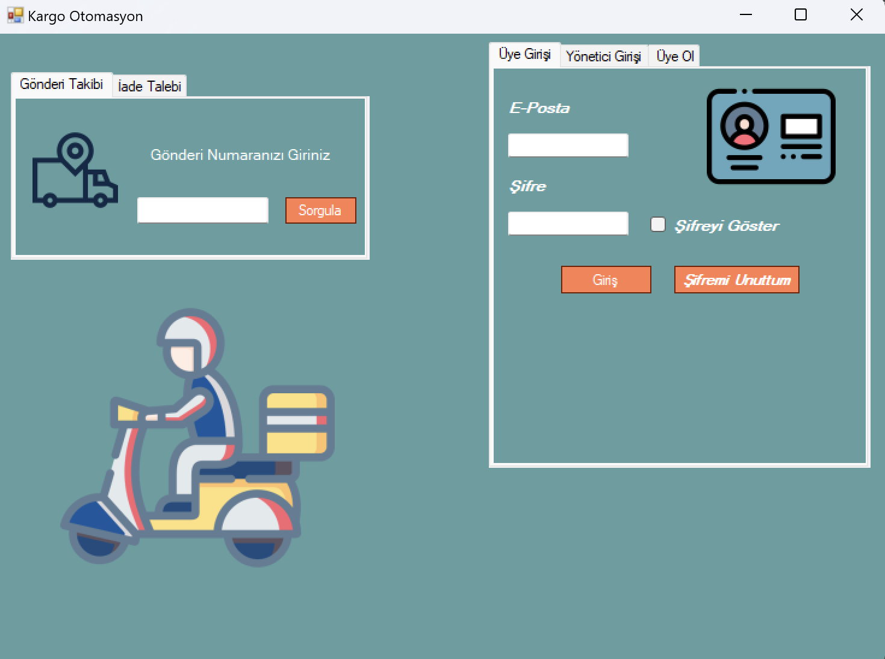
- 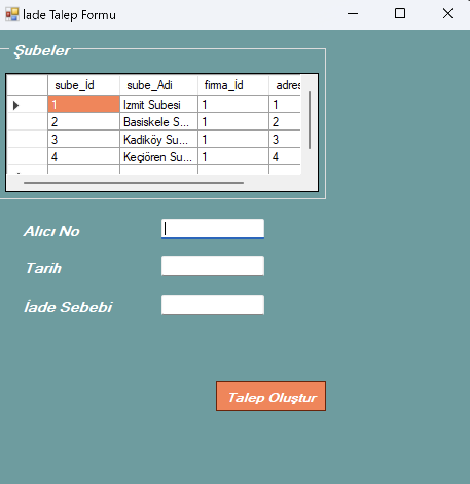
- 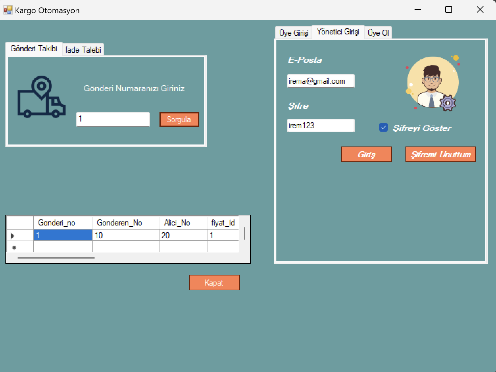
- 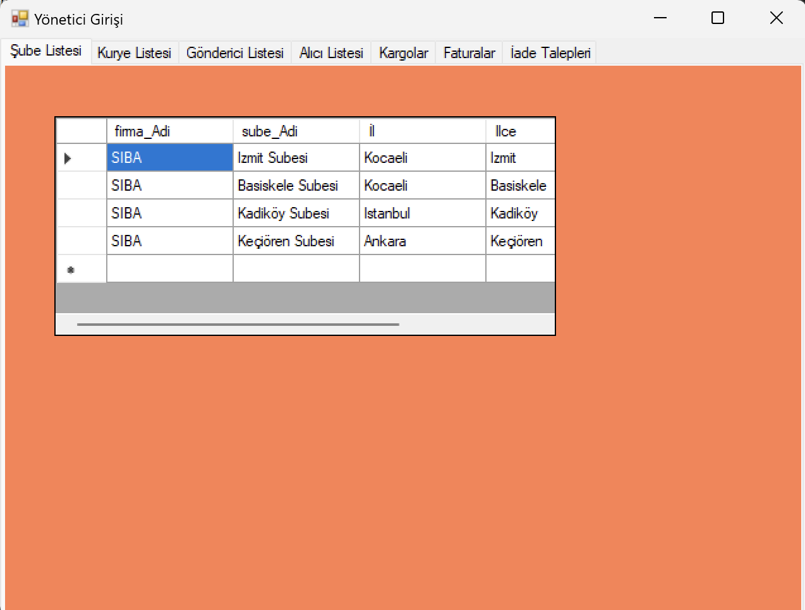
- 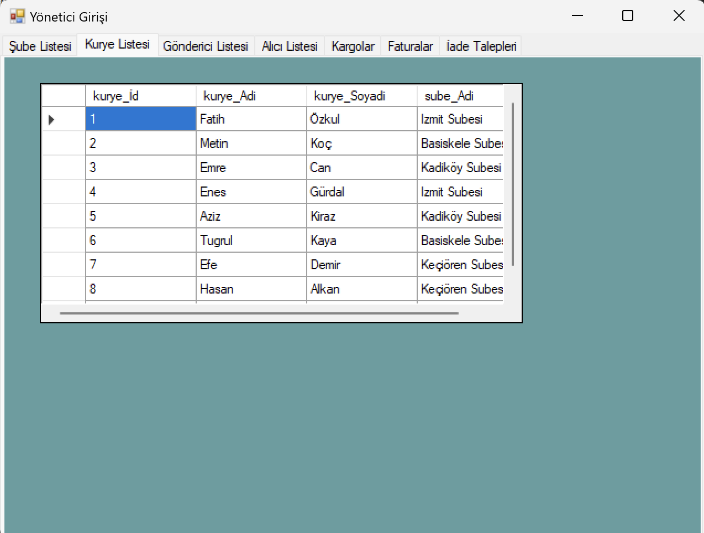
- 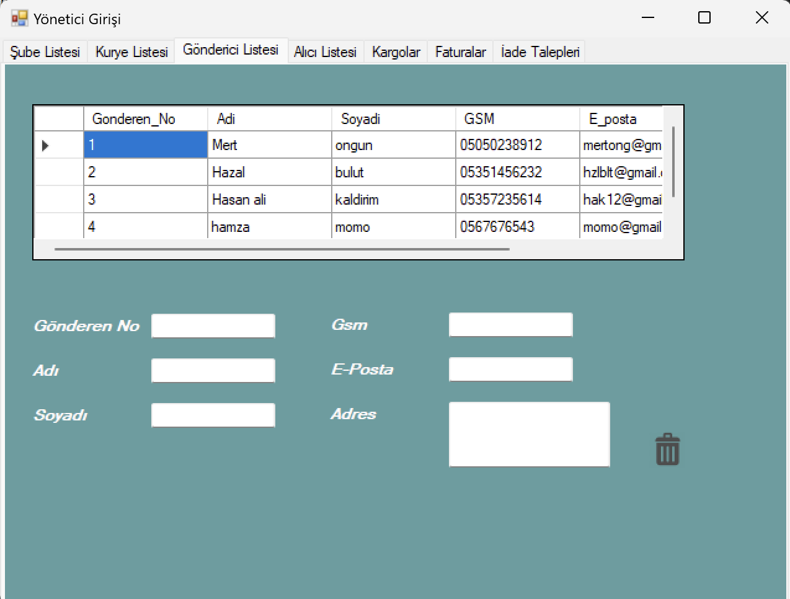
- 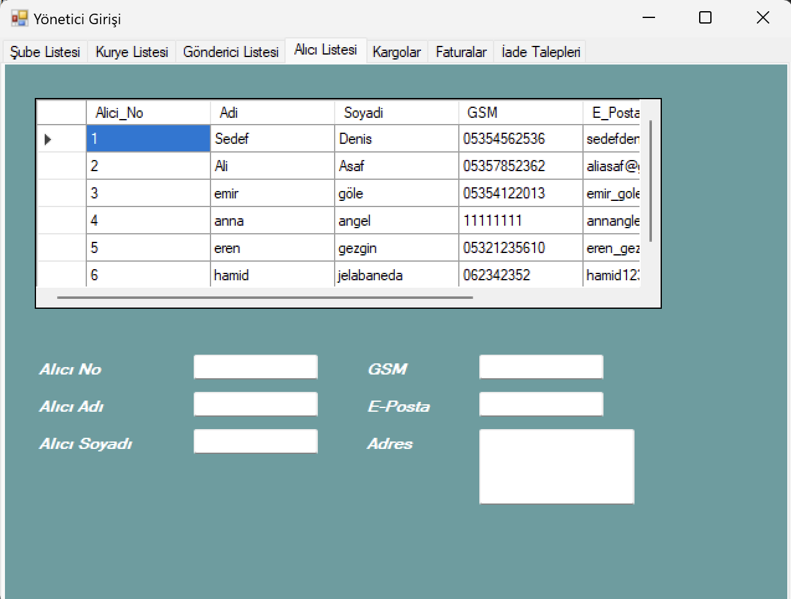
- 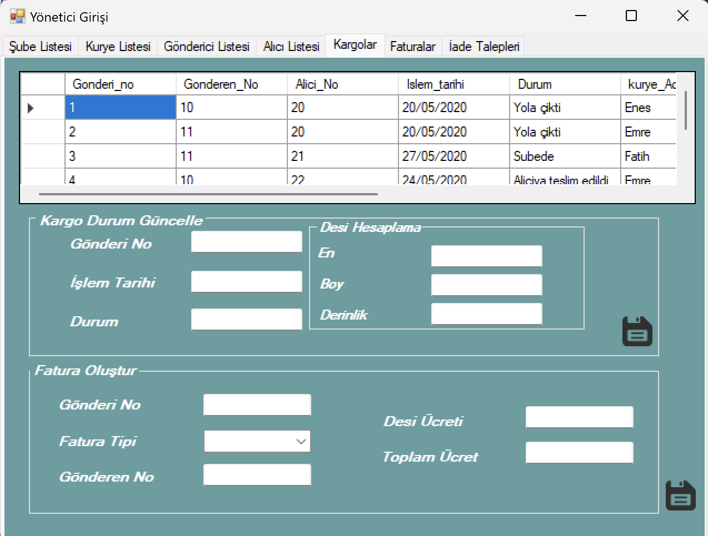
- 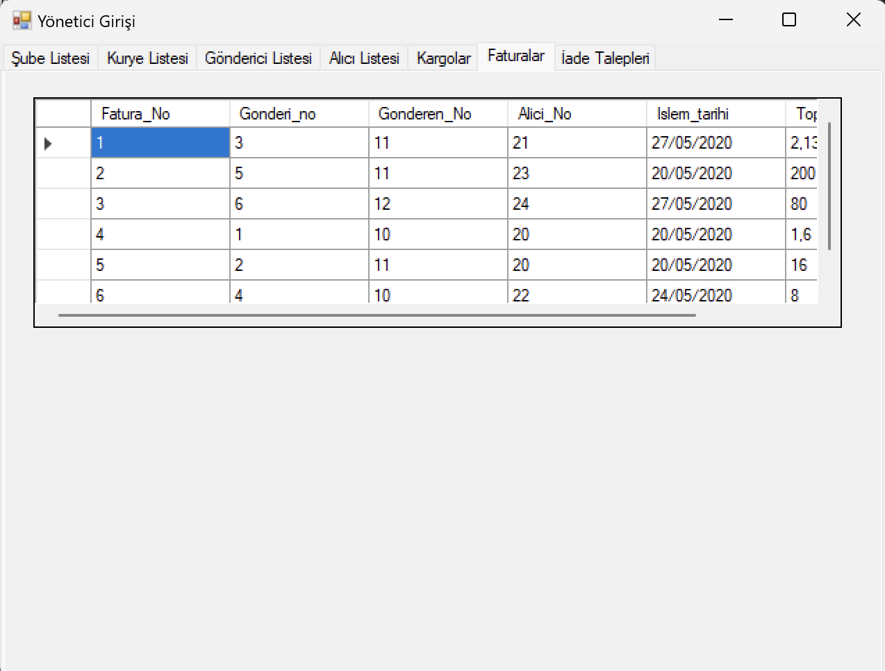
- 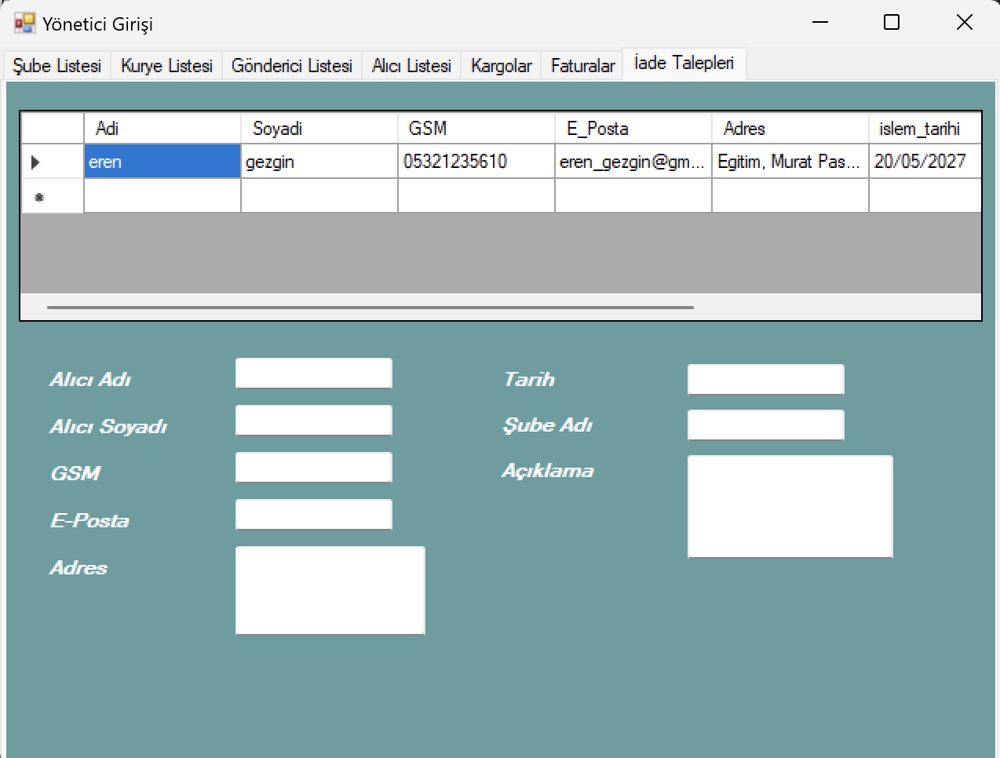
- 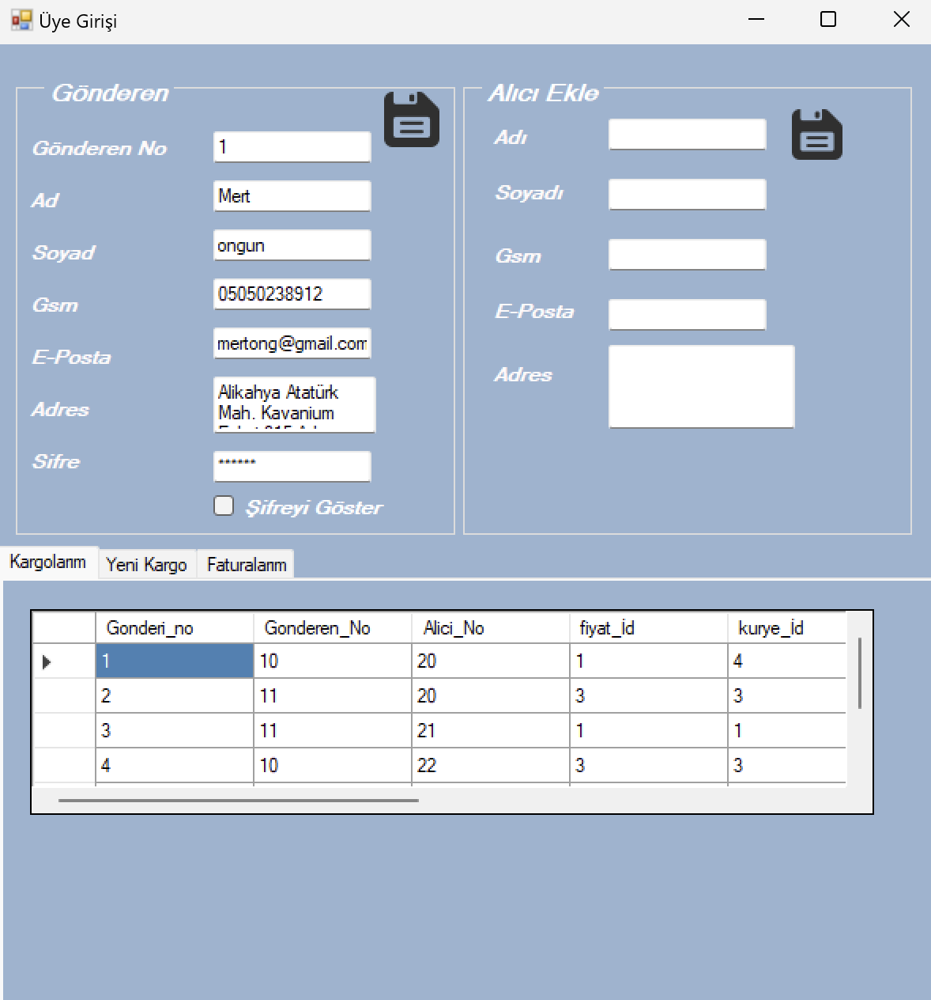
